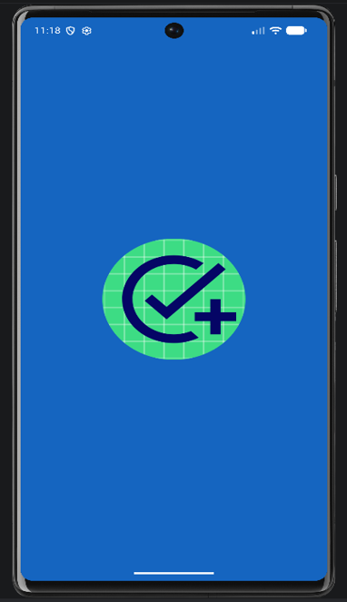
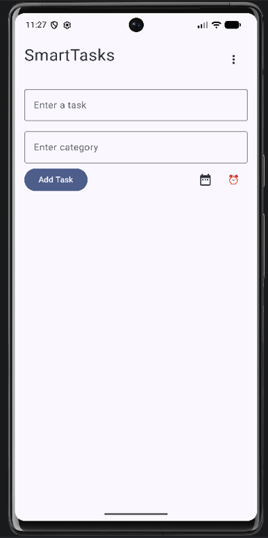
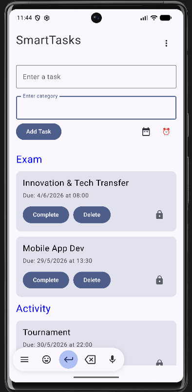
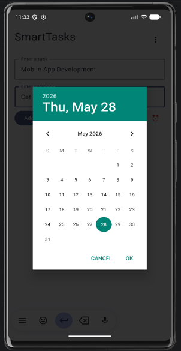
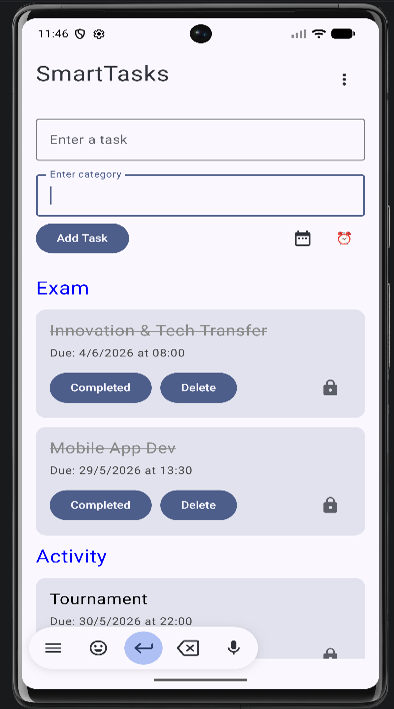

# SmartTasks

SmartTasks is a productivity Android application designed to help users organize their daily activities, manage tasks efficiently, and stay productive. This repository contains the official landing page where users can learn about the application, view screenshots, and download the APK.

## Live Demo

https://smarttasks26.netlify.app/

## Download

Download the latest SmartTasks APK directly from the website.

## Features

- Modern landing page
- App screenshots preview
- Direct APK download
- Responsive design
- Simple and lightweight interface

## Screenshots

included in the website landing page

| Splash Screen | Home |
|------|------|
|  |  |

| Tasks | Reminder | Task-Status |
|----------|------------|----------|
|  |  |  |

---

## Tech Stack

- HTML5
- CSS3

---

## Project Structure

```
SmartTasks/
│
├── index.html
├── styles.css
├── SmartTasks.apk
├── screenshot1.png
├── screenshot2.png
├── screenshot3.png
├── screenshot4.png
├── screenshot5.png
└── README.md
```

---

## Future Improvements

- Google Play Store release
- Dark mode
- Interactive feature showcase
- Download analytics
- Version history

---

## 👨Author

**Yasir Ali Mohammed**

GitHub: https://github.com/yasiralimohammed